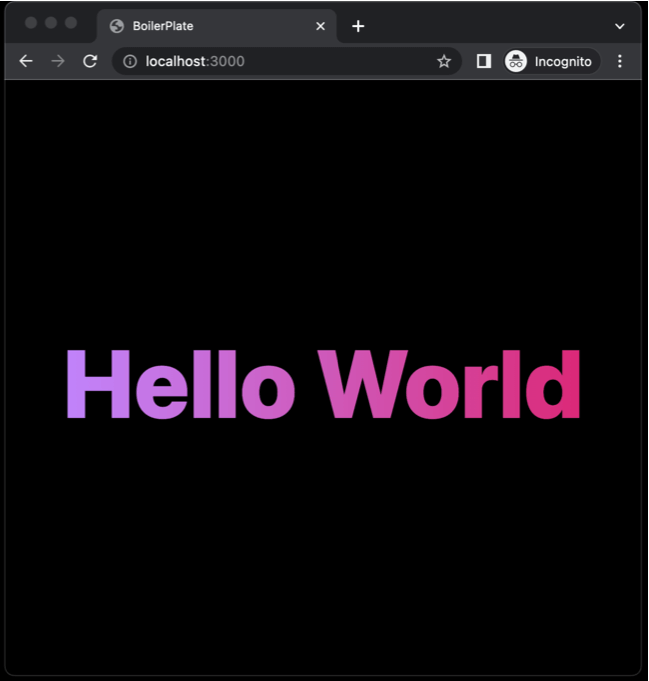

<h1 align="center"> Boilerplate </h1>

<p align="center">
NextJs · Tailwindcss · Eslint · Prettier · Husky · Docker
</p>

<p align="center">
  
</p>

## 👉🏻 Dev usage
```bash
yarn install
yarn dev
```

## 🐋 Docker
```bash
docker compose up
```

## 📦 Tools
- `nextjs` a react framework that enables several extra features, including server-side rendering and generating static websites

- `tailwindcss` a utility-first CSS framework for rapidly building custom user interfaces

- `eslint` to ensure code quality

- `prettier` to ensure that code is properly formatted according to the rules defined
husky: makes it possible to run scripts in our package.json file on git lifecycle hooks

- `eslint-config-prettier` prevents any code formatting conflicts between eslint and prettier. As we know, eslint handles both code quality and code formatting. This package disables the rule in eslint that formats code so that eslint only focuses on ensuring code quality

- `lint-staged` runs defined scripts on only staged files(git)

- `husky` modern native Git hooks made easy

- `docker` provides the ability to package and run an application in a loosely isolated environment called a container


## 👨🏻‍💻 Author
[Cristian Yosafat](https://github.com/blakepro)